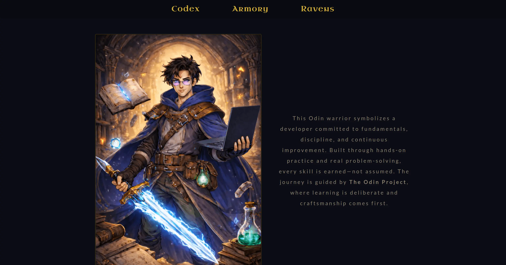
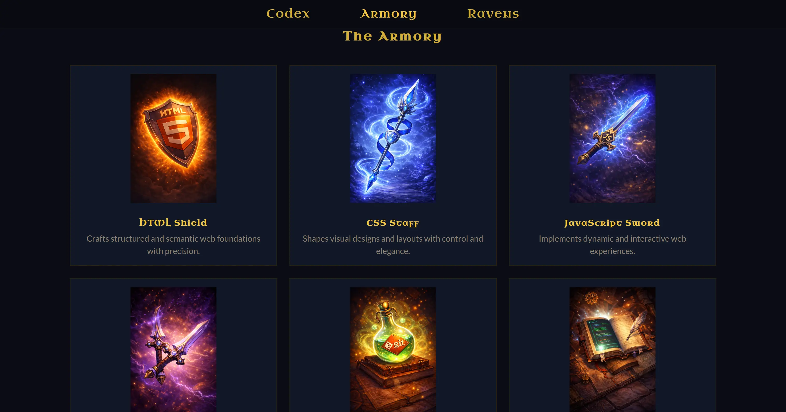
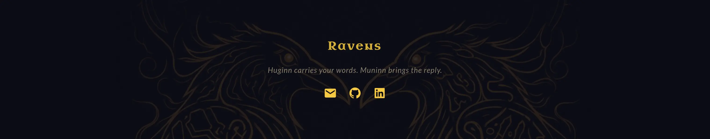

# Project: Odin Warrior Homepage

## Overview

**Odin Warrior Homepage** is a responsive homepage built for the **Advanced HTML and CSS** course from **The Odin Project**. The project’s goal is to practice responsive design, with a focus on *adaptive images* and *CSS media queries* to ensure the layout adjusts smoothly across different screen sizes.

[Odin Warrior Homepage](https://krig6.github.io/odin-warrior-homepage/) - Every warrior needs a homepage!

## Screenshots

## Technologies Used

- **HTML5** – semantic markup for structure
- **CSS3** – styling and layout, including Flexbox, CSS Grid, CSS variables, and media queries for responsiveness
- **Responsive Images** – using `<picture>` with `srcset` and `sizes` for mobile, tablet, and desktop
- **Boxicons** – for social media and contact icons
- **Google Fonts** – Lato for body text and Uncial Antiqua for headings
- **WebP images** – optimized, lightweight graphics
- **Favicon** – browser tab icon (.png)

## Features

- **Responsive** layout for mobile, tablet, and desktop.
- **Semantic HTML** structure for accessibility and SEO.
- **Dynamic** animations and interactive elements
- **Sticky navigation** with smooth section links.
- **Optimized images** using WebP format.
- **Custom fonts** and **Boxicons** for style and icons.
- **Dark theme** with consistent colors, borders, and hover effects.
- **Skill showcase** section with themed images and descriptions.
- **Contact section** with overlayed background and social links.

## Learning Path

Even though this is a small project, I had a lot of fun building it. It was my first time using a *mobile-first approach*, which made the page much easier to make responsive with *fewer media queries*. I learned how layouts adapt naturally as screen sizes increase and explored more advanced CSS techniques, including *art direction*, serving different image versions for various viewports, and understanding *device pixel ratio (DPR)* and *CSS pixels*. It helped me explore design choices through code, balancing aesthetics with responsive functionality. 

This project also showed me how small CSS adjustments can significantly affect the overall layout, motivating me to improve my skills in creating visually balanced, responsive pages.

I realized that **proper preparation and planning**—from selecting images and color themes to defining layout styles—is crucial. Jumping into coding without a clear structure makes building responsive, polished pages much harder.

## Future Enhancements

- Explore additional responsive image techniques for performance.  
- Improve accessibility with keyboard navigation and ARIA labels.  
- Experiment with color themes or dark/light mode toggle.

## Acknowledgments

### Resource and Tools

- [The Odin Project](https://www.theodinproject.com/) 
- [Neovim](https://neovim.io/) 
- [Google Fonts](https://fonts.google.com/) 
- [Boxicons](https://boxicons.com/) 
- [Flaticon](https://www.flaticon.com/) 
- [TinyPNG](https://tinypng.com/) 

### AI Generated Images
- Images were **generated or conceptualized with ChatGPT**
